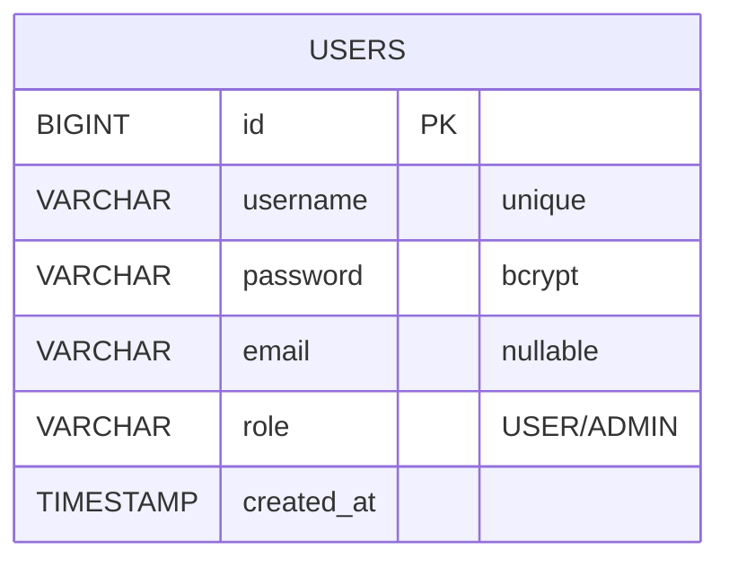
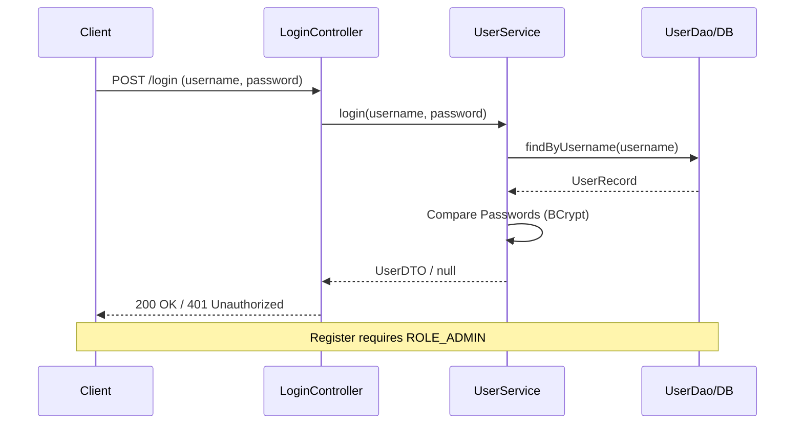

# Architecture & Design Visuals

This document contains text-based diagrams for the Jiocoders Portfolio project. These can be viewed directly on GitHub or via Mermaid-supported Markdown editors.

## 1. Entity Relationship Diagram (ERD)
Visualizes the database schema managed by Liquibase.



## 2. Authentication Workflow
Visualizes the security flow for login and registration.



## 3. Project Route Mapping
Visualizes the new decoupled path structure.

```mermaid
graph LR
    Root[/] --> Portfolio[Portfolio Home Page]
    Root --> APIPrefix[jio.api.prefix: /jiocoders/v1]
    APIPrefix --> Auth[Auth: /login, /register]
    APIPrefix --> Admin[Admin: /admin/users]
    APIPrefix --> API[Public API: /api/hello]
```

---
*Maintained by Gemini Code Assistant*
