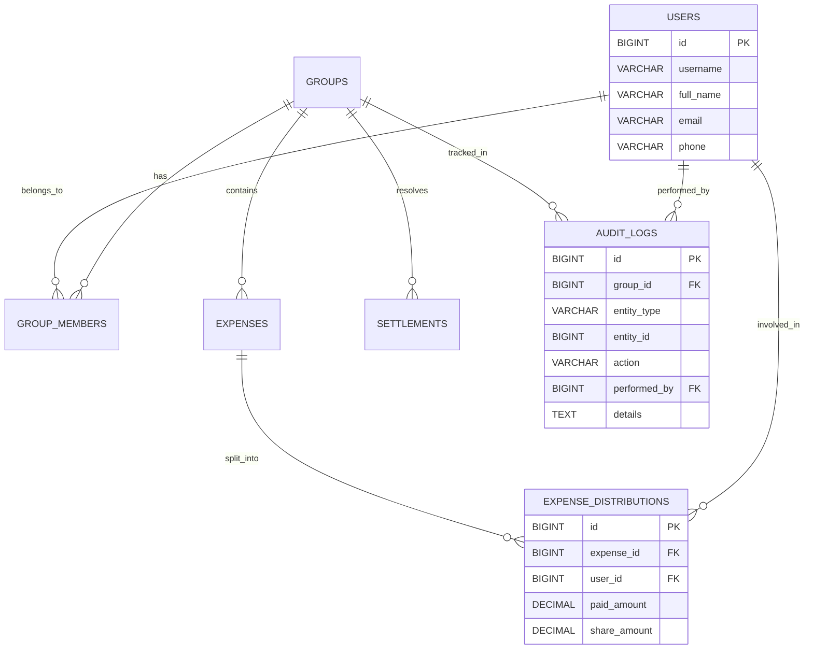

# Architecture & Design Visuals

## 1. Entity Relationship Diagram (ERD) - Expense Management
Visualizes the "Split-wise" style ledger system.

## 2. API Route Mapping
All endpoints are prefixed with `/jiocoders/v1`.

| Category        | Endpoint                       | Method   | Description         |
| :-------------- | :----------------------------- | :------- | :------------------ |
| **Auth**        | `/login`                       | POST     | User Authentication |
| **Groups**      | `/api/groups`                  | POST/GET | Manage Groups       |
| **Expenses**    | `/api/groups/{id}/expenses`    | POST/GET | Add/View Expenses   |
| **Balances**    | `/api/groups/{id}/balances`    | GET      | Net Ledger Per User |
| **Settlements** | `/api/groups/{id}/settlements` | POST     | Record Payments     |

---
*Maintained by Gemini Code Assistant*
